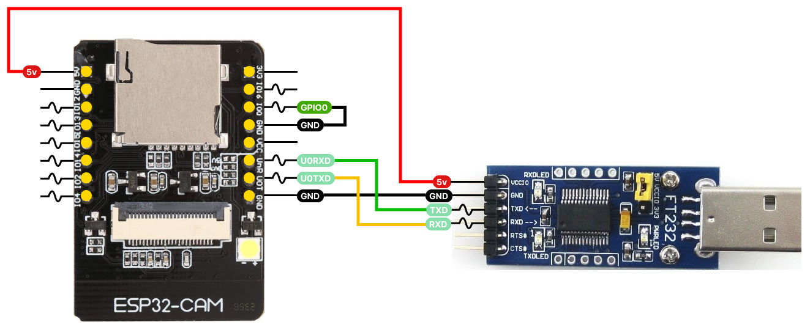

# Smart Camera

The **Smart Camera** project is designed for video surveillance of the engraving process using an ESP32-CAM board. This system allows remote monitoring of the engraving via a web interface, providing access to a video stream transmitted from the camera connected to the ESP32-CAM module.

### Required Components
- **ESP32-CAM** - A module with a camera for video streaming.
- **USB-UART** - A converter for programming and debugging the ESP32-CAM via USB.

## Arduino IDE Setup

### Step 1: Add ESP32 Package
- Open Arduino IDE. 
- Go to **File** -> **Preferences**. 
- In the **Additional Boards Manager URLs** field, add the following link: 
```console  
https://espressif.github.io/arduino-esp32/package_esp32_index.json
```
- Click **OK**.

### Step 2: Install the ESP32 Package

- Go to **Tools** -> **Board:*** -> **Boards Manager...**.
- In the search field, type "esp32".
- Install the **esp32 by Espressif Systems** package.

## Uploading Firmware to ESP32-CAM

### Step 1: Configure Wi-Fi Access
Open the firmware file in Arduino IDE and enter your Wi-Fi network credentials:
```cpp
const char *ssid = "***";
const char *password = "***";
```
Replace *** with your network name (SSID) and password.

### Step 2: Select the Board
- Go to **Tools** -> **Board:*** and select **AI Thinker ESP32-CAM.**

### Step 3: Set Upload Speed
- In **Tools** -> **Upload Speed**, select **115200.**

### Step 4: Choose Partition Scheme
- In **Tools** -> **Partition Scheme**, select **Huge APP (3MB No OTA/1MB SPIFFS).**

### Step 5: Select Port
- In **Tools** -> **Port**, select the port to which your USB-UART adapter is connected.
### Step 6: Connect GPIO0 and GND
Before uploading the firmware, ensure that:


- **GPIO0** and **GND** on the ESP32-CAM board are connected. This puts the board in firmware upload mode.

### Step 7: Upload the Firmware
- Click the **Upload** button in Arduino IDE to upload the firmware to the board.

### Step 8: Restart the Board and Check IP Address
- After successfully uploading the firmware, disconnect the jumper between **GPIO0** and **GND.**
- Press the **Restart** button on the board.
- Open the **Serial Monitor** in Arduino IDE to see the IP address assigned to the board.
- Enter this IP address in a browser to access the video stream from the camera.

## References:

